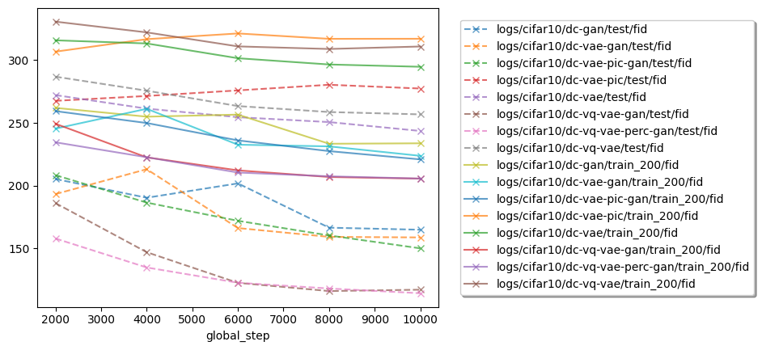

# Image Generation

Compare some image generation models.

## Results

### Figures

#### FID

### Tables

#### Train Subset

| path                                   | split     |  step |     fid |
| :------------------------------------- | :-------- | ----: | ------: |
| logs/cifar10/dc-vq-vae-gan/1673339840  | train_200 | 10000 | 205.634 |
| logs/cifar10/dc-vae-pic-gan/1673335478 | train_200 | 10000 | 220.968 |
| logs/cifar10/dc-vae-gan/1673341055     | train_200 | 10000 | 223.802 |
| logs/cifar10/dc-gan/1673336477         | train_200 |  8000 | 233.425 |
| logs/cifar10/dc-vae/1673339069         | train_200 | 10000 | 294.739 |
| logs/cifar10/dc-vae-pic/1673338278     | train_200 |  2000 | 306.798 |
| logs/cifar10/dc-vq-vae/1673337406      | train_200 |  8000 | 308.909 |

#### Test set

| path                                   | split |  step |     fid |
| :------------------------------------- | :---- | ----: | ------: |
| logs/cifar10/dc-vq-vae-gan/1673339840  | test  |  8000 | 116.086 |
| logs/cifar10/dc-vae-pic-gan/1673335478 | test  | 10000 | 150.127 |
| logs/cifar10/dc-vae-gan/1673341055     | test  | 10000 | 158.812 |
| logs/cifar10/dc-gan/1673336477         | test  | 10000 | 164.936 |
| logs/cifar10/dc-vae/1673339069         | test  | 10000 | 243.624 |
| logs/cifar10/dc-vq-vae/1673337406      | test  | 10000 | 256.828 |
| logs/cifar10/dc-vae-pic/1673338278     | test  |  2000 | 267.614 |
